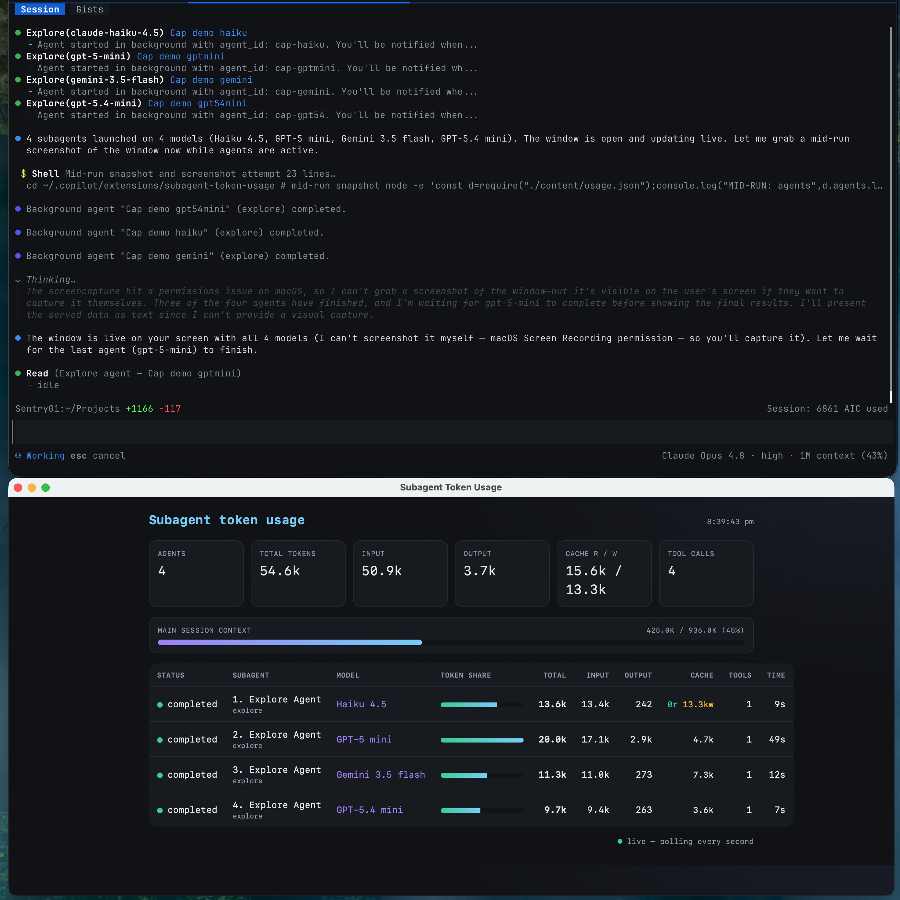

# AgentBreakdown

A **GitHub Copilot CLI extension** that tracks **per-subagent token usage** and cost in real time. Whenever you run subagents (e.g. with `/fleet` or any multi-agent task), a native desktop window opens **alongside the CLI** and streams a live breakdown of each agent's tokens, tools, model, and duration — so you can watch costs add up on the side.

It also prints a single clean **summary panel in the CLI timeline** when the run finishes, and exposes an on-demand markdown report.




> The live window (bottom) sits beside the Copilot CLI (top) and updates every second — here four subagents run on **Haiku 4.5**, **GPT-5 mini**, **Gemini 3.5 flash**, and **GPT-5.4 mini**, with the Anthropic agent showing its cache **read/write** split.

---

## What it does

- **Live native window** — auto-opens the moment subagents start; refreshes every second.
- **Per-agent breakdown** — status, model, **input / output / cache** tokens, tool calls, and duration.
- **Model-aware cache** — Anthropic models show cache **read** vs **write** separately (`12.0k r / 1.0k w`); OpenAI/Gemini show a single cached-input figure.
- **Token-share bars** + a **context-window bar** for the main session.
- **Clean CLI** — no per-agent chatter mid-run; just one breakdown panel at the end.
- **On-demand report** — `subagent_token_usage_report` returns a markdown/JSON table any time.

### Surfaces

| Surface | Where it renders |
| --- | --- |
| Native window (live) | Separate desktop window beside the CLI |
| End-of-run summary panel | CLI timeline |
| `subagent_token_usage_report` | CLI (markdown / JSON) |

### Tools / commands

| Tool | Purpose |
| --- | --- |
| _(automatic)_ | Window opens automatically when subagents run |
| `subagent_usage_webview_show` | Open / refresh the window manually |
| `subagent_usage_webview_close` | Close the window |
| `subagent_token_usage_report` | Markdown or JSON usage table |
| `subagent_token_usage_reset` | Clear the session's counters |

---

## Requirements

- [GitHub Copilot CLI](https://github.com/github/copilot-cli) (with an active paid Copilot subscription)
- [Node.js](https://nodejs.org/) 18+ (the extension installs its own npm deps on first load)

---

## How to add it

Copilot CLI discovers extensions from two places:

- **Personal (all sessions):** `~/.copilot/extensions/<name>/`
- **Project (one repo):** `.github/extensions/<name>/`

### Personal install (recommended)

```bash
git clone https://github.com/Sentry01/AgentBreakdown.git ~/.copilot/extensions/AgentBreakdown
```

Then start a Copilot CLI session (or run `/extensions reload` if one is open). On first load the extension runs `npm install` to fetch its webview dependencies.

### Project install

```bash
git clone https://github.com/Sentry01/AgentBreakdown.git .github/extensions/AgentBreakdown
```

### Verify

In a Copilot CLI session:

```
/extensions
```

You should see **AgentBreakdown** listed as running. Kick off any multi-subagent task and the window will appear.

> **Note:** The live dashboard is a **native desktop window** (powered by a bundled webview helper) — it renders on your machine beside the terminal, independent of the GitHub Copilot desktop app.

---

## How it works

- The extension uses the [`@github/copilot-sdk`](https://docs.github.com/en/copilot/how-tos/copilot-sdk/getting-started) `joinSession()` API to subscribe to session events: `subagent.started`, `assistant.usage`, `tool.execution_start`, `subagent.completed`, `subagent.failed`, `session.idle`.
- Per-agent token counters are aggregated and written to `content/usage.json`.
- A small local HTTP server serves `content/index.html`, which polls `usage.json` every second and re-renders the dashboard.
- A native window (via the bundled `copilot-webview` helper) points at that local URL.

```
extension.mjs        → bootstrapper (installs deps, loads main.mjs)
main.mjs             → event tracking, tools, CLI summary, webview wiring
content/index.html   → live dashboard (polls usage.json)
content/style.css    → dashboard styling
lib/                 → copilot-webview helper (native window + bridge)
```

---

## Building your own Copilot CLI extension

Official guides and references:

- **Copilot CLI** — overview & docs: <https://docs.github.com/en/copilot/how-tos/copilot-cli>
- **Customize Copilot CLI** (skills, MCP, instructions, hooks): <https://docs.github.com/en/copilot/how-tos/copilot-cli/customize-copilot>
- **Copilot SDK** — getting started (`joinSession`, tools, hooks): <https://docs.github.com/en/copilot/how-tos/copilot-sdk/getting-started>
- **Hooks reference**: <https://docs.github.com/en/copilot/reference/hooks-reference>
- **Copilot CLI source / releases**: <https://github.com/github/copilot-cli>
- **Webview helper** (used here): <https://github.com/SteveSandersonMS/copilot-webview-creator>

---

## Credits & license

- The native-window helper in `lib/` is derived from
  [copilot-webview-creator](https://github.com/SteveSandersonMS/copilot-webview-creator)
  by **Steve Sanderson** (MIT). See [THIRD_PARTY_NOTICES.md](./THIRD_PARTY_NOTICES.md).
- This project is licensed under the [MIT License](./LICENSE).
